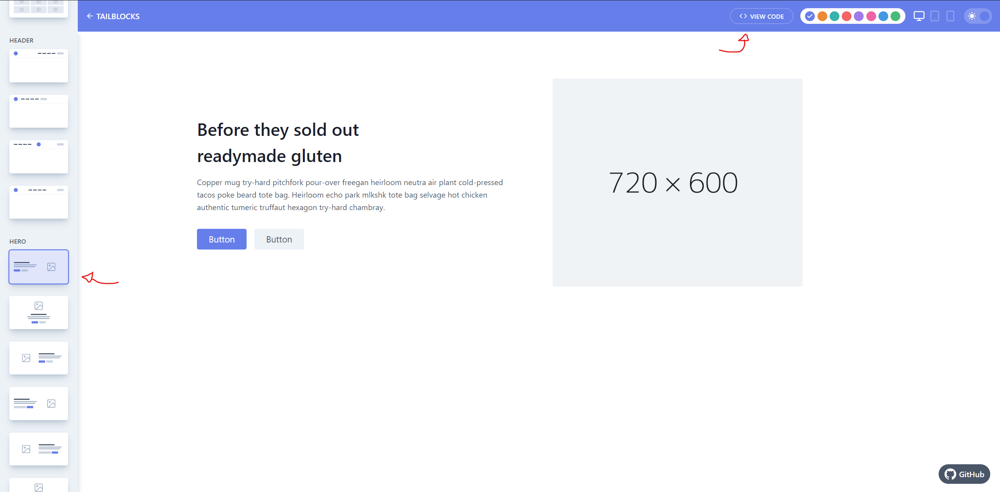
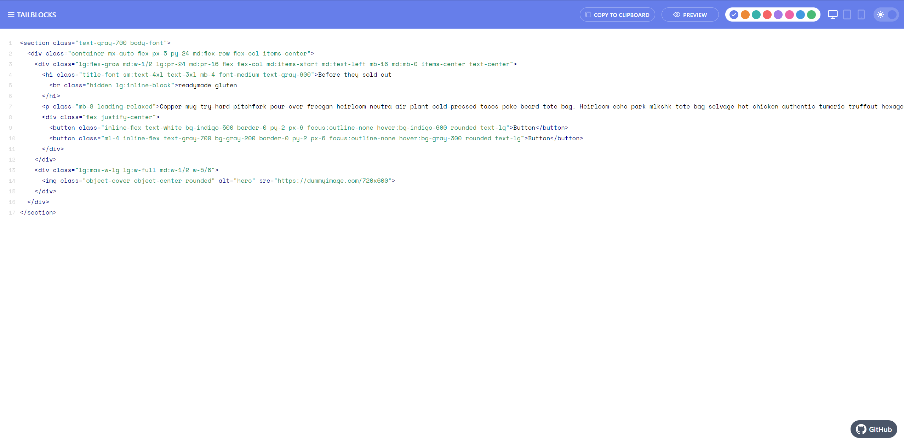
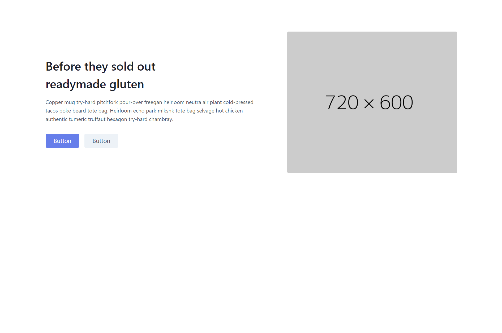

As a Frontend / UI developer, I cannot count how many times I was asked to implement the same header, hero section, features section and footer. Needless to say that, while these may seem trivial, building them from scratch can be a pain, specially if you are in a time constrained environment. Adding that to having doubts on design fundamentals and all of a sudden a nice project becomes a source of stress. Like myself, if you are or were in this situation, fear no more!

[Tailwind CSS](https://tailwindcss.com/) is a utility-first CSS framework that saves us time by having *tons* of common css classes available for use. [Tailblocks](https://mertjf.github.io/tailblocks/) is a project by [Mert Cukuren](https://github.com/mertJF) which contains lots of common UI component patterns (hence the name, blocks) built with Tailwind CSS. Without further ado, let's start coding!


## Setting up the environment

For brevity, I will be using `create-react-app` but feel free to bootstrap your react application whichever way you desire.

```
$ npx create-react-app my-new-fancy-project && cd my-new-fancy-project
```

Then, we need to install the dev dependencies:

```
$ npm install tailwindcss postcss-cli autoprefixer -D
```

After that, we need to initialize Tailwind CSS by create a default configuration using its own CLI.

```
$ npx tailwind init tailwind.js --full
```

Next, let's create the Post CSS configuration file `postcss.config.js` in the root directory and adding the following:

```js
const tailwindcss = require('tailwindcss');
module.exports = {
    plugins: [
        tailwindcss('./tailwind.js'),
        require('autoprefixer')
    ],
};
```

We are almost done! Now we need to import the Tailwind CSS base styles and configurations. To do so, create a file `tailwind.css` in a folder of your preference (for example, `src/assets/`) and add the following directives:

```css
@tailwind base;

@tailwind components;

@tailwind utilities;
```

These directives will be swapped during build time by all of the CSS generated by Tailwind CSS. The only thing left is to update our `package.json` scripts so that we have Post CSS added to the process.

```json
// package.json
"scripts": {
  "start": "npm run watch:css && react-scripts start",
  "build": "npm run build:css && react-scripts build",
  "test": "react-scripts test",
  "eject": "react-scripts eject",
  "build:css": "postcss src/assets/tailwind.css -o src/assets/main.css", 
  "watch:css": "postcss src/assets/tailwind.css -o src/assets/main.css"
},
```

Note that the `build:css` and the `watch:css` scripts outputs (`-o`) to `src/assets/main.css` but you can choose whichever file / folder you prefer.

Finally, let's put it to use! In your `index.js` we should import the file that was outputted by Post CSS:

```jsx
import React from "react";
import ReactDOM from "react-dom";
import "./assets/main.css"; // THIS IS THE IMPORTANT LINE
import App from "./App";

ReactDOM.render(<App />, document.getElementById("root"));
```

Now we are ready to use Tailwind CSS *and* we are able to copy-paste the super nice blocks from Tailblocks into our project! For instance, let's say we want a common hero section to bootstrap our page and we the one that we like is this one:



It is a matter of clicking the `<> View Code` button, copying the code there and adding to our project.



One thing to notice though is that React uses `className` instead of `class` so you need to make those changes. Also, it doesn't play nice with tags that are not self-closed or does not have a closing tag (like `<br>` or ``) so you might need to "lint" these details while copy-pasting.

This is what the source code of our app would look like:

```jsx
import React from "react";

function App() {
  return (
    <div>
      <section className="text-gray-700 body-font">
        <div className="container mx-auto flex px-5 py-24 md:flex-row flex-col items-center">
          <div className="lg:flex-grow md:w-1/2 lg:pr-24 md:pr-16 flex flex-col md:items-start md:text-left mb-16 md:mb-0 items-center text-center">
            <h1 className="title-font sm:text-4xl text-3xl mb-4 font-medium text-gray-900">
              Before they sold out
              <br className="hidden lg:inline-block" />
              readymade gluten
            </h1>
            <p className="mb-8 leading-relaxed">
              Copper mug try-hard pitchfork pour-over freegan heirloom neutra
              air plant cold-pressed tacos poke beard tote bag. Heirloom echo
              park mlkshk tote bag selvage hot chicken authentic tumeric
              truffaut hexagon try-hard chambray.
            </p>
            <div className="flex justify-center">
              <button className="inline-flex text-white bg-indigo-500 border-0 py-2 px-6 focus:outline-none hover:bg-indigo-600 rounded text-lg">
                Button
              </button>
              <button className="ml-4 inline-flex text-gray-700 bg-gray-200 border-0 py-2 px-6 focus:outline-none hover:bg-gray-300 rounded text-lg">
                Button
              </button>
            </div>
          </div>
          <div className="lg:max-w-lg lg:w-full md:w-1/2 w-5/6">
            
          </div>
        </div>
      </section>
    </div>
  );
}

export default App;
```

And this is the result:




## Take away (TL;DR)

As a bootstrapping / template starter, Tailblocks can save you a LOT of time by already implementing common UI patterns and making them look great from the start. The setup from the ground up in a React based application is a little tedious but you don't have to do it more than once. If you are as lazy as I am, you can save that project started in GitHub (feel free to use my own, if you wish) and you don't have to do it again.

If you are not using React and prefer a video rather and a blog post, I highly recommend this one:

[https://www.youtube.com/watch?v=ST3fmk8UG8I](https://www.youtube.com/watch?v=ST3fmk8UG8I)