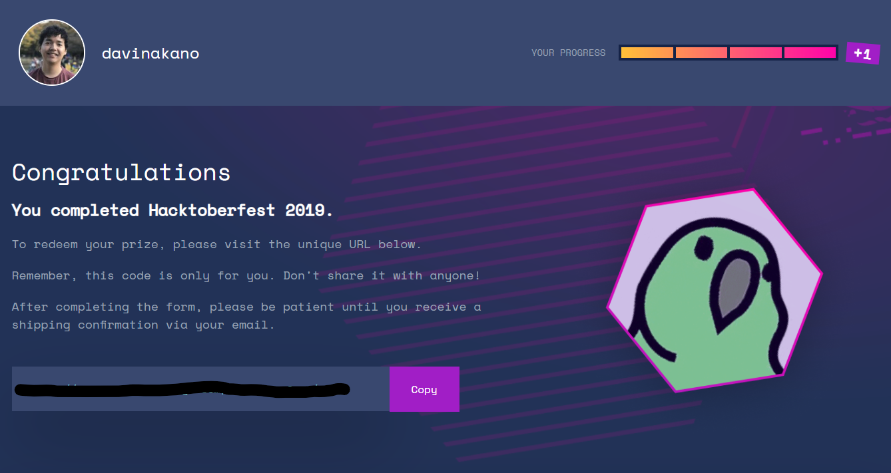
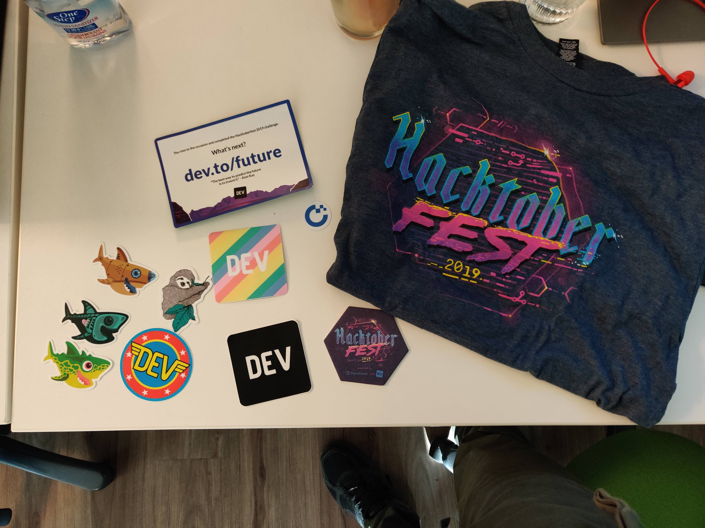

#### Taking the leap

In the past few years, I confess that I have been jealous of a few ex co-workers who walked around the office with their Hacktoberfest t-shirt.

I thought to myself: "That's so cool! If only I were smarter / better dev / _worthy_ ... I would then contribute to all the repositories and join this 'secret society of open source developers'".

This year, 2019, I decided to challenge myself to do it and guess what? I was able to finish! Yey! However, I couldn't be more wrong than I was by thinking the above. **There is no such a thing as a secret society of open source developers**.

That is not the only thing I learned through the process though. Let me share some of the takeways from (finally) participating.

#### There is no such a thing as a secret society of open source developers

Yes, I know I have said that but let it sink in for a moment.

Ready?

I used to believe that I had nothing to contribute to open source. Even though I have been through the "classical" path of getting a Computer Science degree, working on various companies and even in different countries, I still strongly believed that everyone on the Internet was better than me. I felt like somehow I missed the open source train.

By heavily relying on open source in order to build software and yet not reaching the full capabilities of any of them, I thought that my knowledge was subpar to the high level discussions in the GitHub repositories of the tools that I use on a daily basis.

How could I contribute to React / Webpack / Gatsby / Material-UI / etc? They are so... complete?

In one of the countless days that I was meditating about this, I was reading the documentation on how to migrate between versions of [Material-UI](https://material-ui.com/) and I came across a super small typo. That typo motivated me to send a [pull request to the repo](https://github.com/mui-org/material-ui/pull/16553). That was my very first pull request ever to an open source project.

Wow! I was so happy. People were very receptive and I found out that they were humans. I also found out that I could contribute! All of a sudden, the inexistent veil that covered this obscure society was now finally gone.

And yes, that pull request was back in July but it was so important to understand the next takeway that happened during my Hacktoberfest GitHub repository search journey.

#### There are SO many repositories that could use help

When the Hacktoberfest started, I went looking for repositories that I could contribute to and of course I had briefly forgotten my previous meditations and went straight to the famous tools. The result? I started doubting myself again.

Then I thought: "Wait. Maybe there are _other_ repositories in which my knowledge could help!". Results came back with over a thousand matches to the query that I tried searching for. Nice.

I ended up [helping a person correct the wording on how to explain React basics in a comprehensive guide](https://github.com/Swap76/ReactJSBasics/pull/10) and  [fixing a broken link in a readme file](https://github.com/lnfnunes/404-PageNotFound/pull/117), for instance. Very small contributions for sure but hey, maybe it helped a little bit, right?

#### Helping other people to have the same sense of being part of a bigger community makes all the difference

I talked with other co-workers about the Hacktoberfest. Surprisingly or not, I heard similar stories with mine about the fear / lack of confidence that prevented them from even trying.

One in special, let's call him John for now, was very interesting. He is currently on Customer Support and self-learning how to code. When I mentioned about the Hacktoberfest he thought it was so cool and he told me he had just created his GitHub account and was learning Git.

Promptly, I said that I could help him with that and that I could walk him through his first pull request. We scheduled a day and time and we spent about an hour in Git overview and most used commands / browsing GitHub / setting up his environment.

While browsing issues, he saw one where he could add another entry in a JSON file as an example for others. He had the same epiphany of thinking "wow, that is it? maybe I can help others as well!", after he submitted his pull request. His happiness and motivation of studying more and interacting more with this world: priceless.

#### I will _definitely_ participate next year

I appreciate SO much all the work that open source contributors have done throughout all these years. Being a Web Developer myself, they are literally the reason why I have a job and why it is possible to create so much so quickly. Special thanks to the incredible [freeCodeCamp](https://learn.freecodecamp.org/) that made my learning possible.

I hope I could motive you, my reader (and myself), to get involved and not to be afraid of contributing.

Cheers!